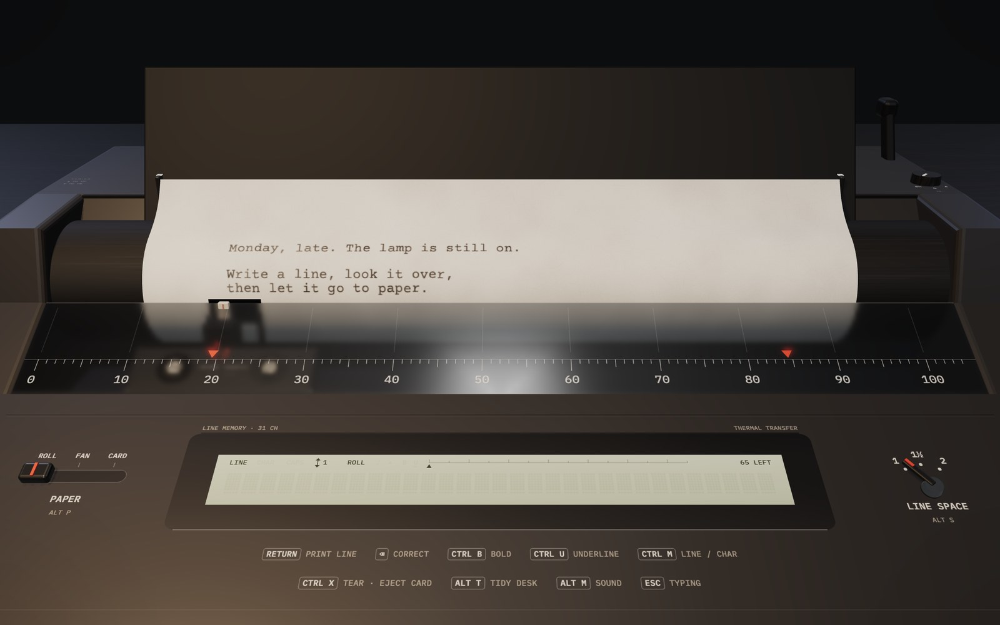

# Platen



A line-memory thermal typewriter on a desk, in three.js. Write a line on the little display, press Return, and a thermal head prints it onto paper. Tear the page off and it lands on the desk with everything else you've written. It runs at [platenwriter.app](https://platenwriter.app), and [How it works](https://platenwriter.app/how-it-works/) takes the machine apart piece by piece.

A design experiment by [Saleh Kayyali](https://x.com/mskayyali), exploring direction as a way of designing: built with Claude Opus 5.5 by directing it. MIT licensed.

```bash
npm install
npm run dev        # http://localhost:5188
npm run build      # static site in dist/
npm run preview    # serve the build on :5189
```

## Layout

- `src/main.js`: scene, machine, paper, desk, input, camera, render loop
- `src/sound.js`: all audio (synthesised, modelled on a recorded Canon Typestar)
- `src/lcdfont.js`: 5×7 dot-matrix font for the display
- `src/store.js`: IndexedDB persistence (one record per scrap)
- `src/util.js`: small shared helpers

`public/how-it-works/` is the guide page: a standalone HTML file with its own copy of the machine, loading three.js from jsDelivr.

Everything is saved locally in the browser. A save from the earlier single-file version (localStorage) is imported automatically on first run.

## Deploy (Render, free static site)

1. Put this folder in its own Git repository and push it to GitHub or GitLab.
2. In Render: **New → Blueprint**, pick the repository. `render.yaml` sets the build (`npm ci && npm run build`), publishes `dist/`, adds cache and security headers, and attaches `platenwriter.app` and `www.platenwriter.app`.
3. At your domain registrar, add the DNS records Render shows for the two domains (an `A`/`ALIAS` for the apex and a `CNAME` for `www`). Render issues the TLS certificate automatically.
4. After it's live, add the site in Google Search Console and submit `https://platenwriter.app/sitemap.xml`.

`public/` holds the favicon, touch icons, the social card (`og.png`), `manifest.webmanifest`, `robots.txt` and `sitemap.xml`; they're copied into the build as-is.
